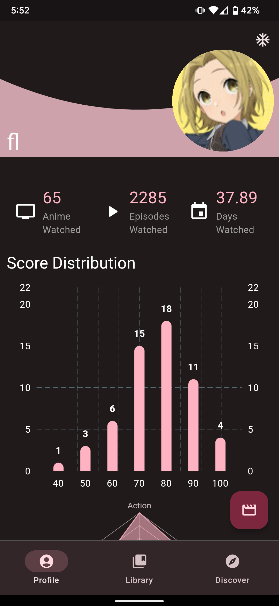
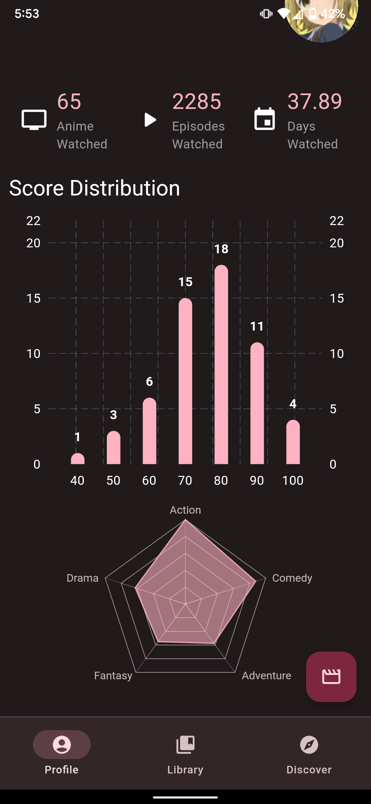
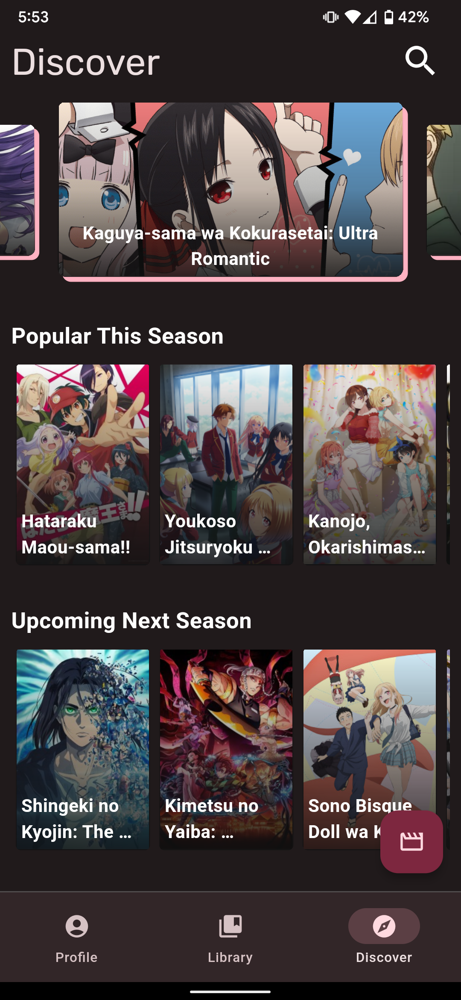
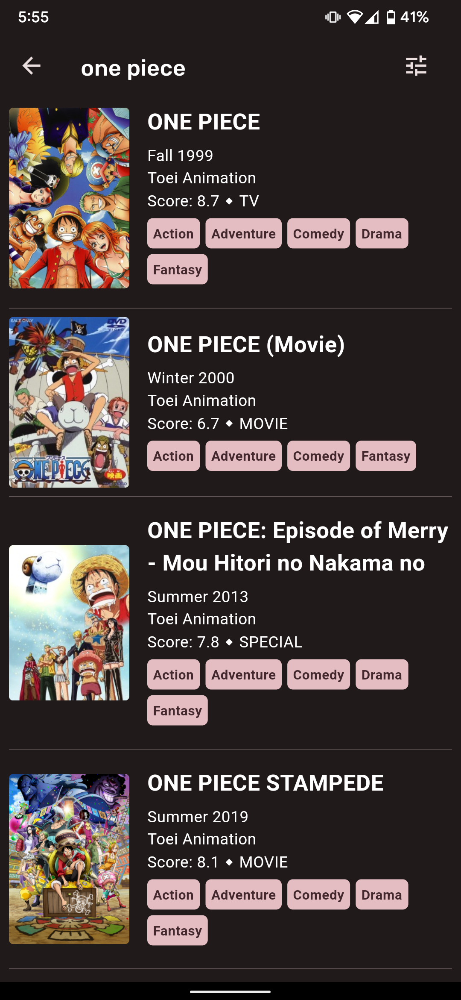
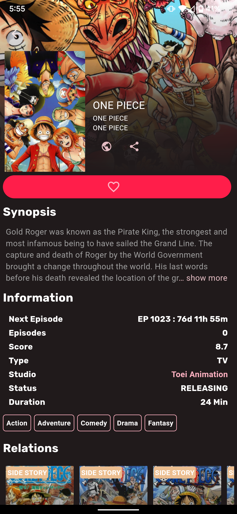
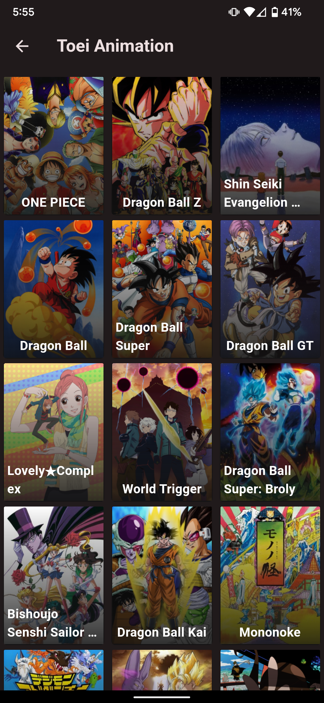

# Flutter-Anilist Client - eiga
(`eiga` has been used internally in the project as a potential name)

I started this project to learn Flutter around 2020 (first mobile app project) and therefore has alot of obvious mistakes :)

---

This project uses the [Anilist API](https://anilist.gitbook.io/anilist-apiv2-docs/) to get its data - for every media entry as well as user details.
Currently it has these features:
1. Authentication using Anilist OAuth
2. Querying data using GraphQL
3. Fetch User data
4. Mode switching between Manga/Anime modes
5. *Discover* page with Trending, Popular and similar lists
6. Detailed Media information including recommendations and adaptations
7. Search for specific media
8. Studio At-a-glance
9. Very early implementation of Library system

---

### Some screenshots :
|Profile||
|---|---|
|

|Discover|Search|
|---|---|
|

|Media Details|Studio|
|---|---|
|

